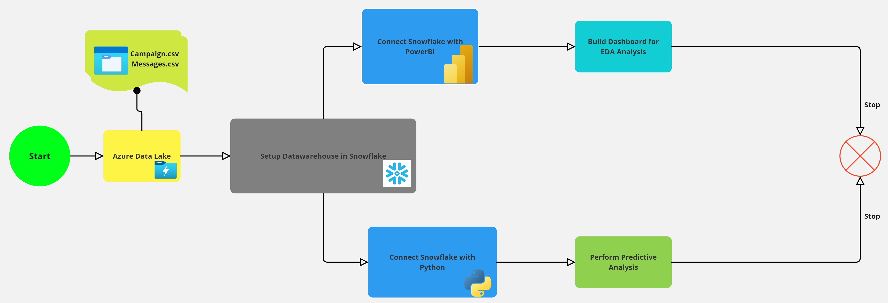
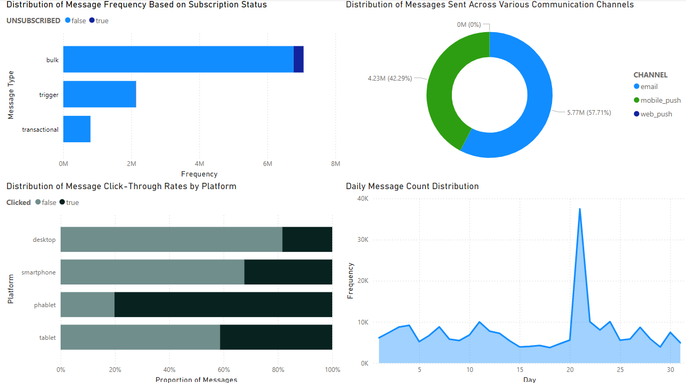

# Message-Distribution-Analysis

## Decription

Picture a bustling digital marketplace, where a medium-sized retail company weaves an intricate tapestry of communication with its customers. This vibrant tapestry, spanning two years, is a kaleidoscope of messages, each thread representing a different channel: the swift arrows of email, the gentle whispers of web push notifications, the insistent taps of mobile alerts, and the direct drumbeats of SMS.

Within this grand design, three distinct patterns emerge:

1. The broad strokes of bulk campaigns, painting wide swathes of the customer landscape.
2. The reactive tendrils of trigger campaigns, responding to customer actions like a sensitive plant.
3. The steady, functional stitches of transactional messages, holding the fabric of commerce together.

Each message in this tapestry is a living entity, carrying with it a wealth of stories. These stories unfold in the form of statistics, revealing the journey of each communication:

- How many found their mark, landing successfully in customer inboxes or devices?
- Which ones caught the eye, enticing customers to open and explore?
- Which sparked a reaction, compelling clicks and engagement?
- And ultimately, which ones kindled the flames of purchase, turning interest into action?

But this tapestry also tells tales of rejection and mishap:

- The unraveling threads of unsubscribes, where customers choose to step away.
- The knots of spam complaints, where messages are misunderstood or unwelcome.
- The frayed edges of bounces, where communications fail to find their target.

This rich, dynamic dataset is a living history of customer interaction, a treasure trove of insights waiting to be unraveled by the keen eye of an analyst. It's not just numbers and channels – it's a story of connection, reaction, and the ever-evolving dance between a company and its customers in the digital age.

## Tecnology Used:

1. Azure Data Lake Gen 2 (Blob Storage)
2. Snowflake
3. PowerBI
4. Python
    - Scikit-learn
    - SMOTE

## Exploratory Data Analysis:

1. Data Storage in Azure Data Lake:
The initial data, comprising campaign and message information in CSV format, is stored in Azure Data Lake. This cloud-based storage solution provides a scalable and secure repository for the raw data files.
Data Extraction and Warehouse Construction in Snowflake:
A data extraction process is implemented to transfer the data from Azure Data Lake to Snowflake, a cloud-based data warehousing platform. This process involves:
    a. Establishing a connection between Azure Data Lake and Snowflake.
    b. Creating the necessary data warehouse structure in Snowflake, including databases and schemas.
    c. Designing and implementing staging areas for initial data landing.
    d. Defining and creating tables to store the transformed data.
2. Data Transformation and Consolidation:
A data transformation process is executed within Snowflake to merge the campaign and message data. This process involves:
    a. Performing an inner join operation between the campaign and message tables, using the campaign ID as the joining key.
    b. Applying a filtering condition to ensure that only records with matching campaign types between the two tables are included.
    c. Creating a new consolidated table named "message_extended" that contains the merged and filtered data.

3. Data Visualization in Power BI:
The final stage of the process involves connecting Power BI, a business intelligence and data visualization tool, to Snowflake. This connection enables:
    a. Retrieval of data from the "message_extended" table in Snowflake.
    b. Creation of various visualizations based on the consolidated data, providing insights and facilitating data-driven decision-making.

## Predictive Analysis:
1. Data Retrieval: 
Establish a connection between Python and Snowflake to extract data from the message_extended table.

2. Data Cleaning:
Perform necessary data cleaning operations to ensure data quality and consistency.

3. Data Transformation:
Convert binary categorical variables represented as 'F' and 'T' to numerical values 0 and 1 respectively across multiple columns.

4. Feature Engineering:
Transform the 'SENT_AT' datetime column into a categorical feature representing four distinct time periods: 'Morning', 'Afternoon', 'Evening', and 'Night'.

5. Class Imbalance Mitigation:
Apply Synthetic Minority Oversampling Technique (SMOTE) to address the class imbalance in the target variable 'IS_OPENED', where class 1 is significantly underrepresented compared to class 0.

6. Predictive Modeling:
Implement and evaluate multiple machine learning algorithms for predictive analytics, including:

    - Light Gradient Boosting Machine (LightGBM)
    - Random Forest
    - Gradient Boosting
    - Logistic Regression

Among these models, Gradient Boosting demonstrated superior performance in predicting both classes of the target variable.